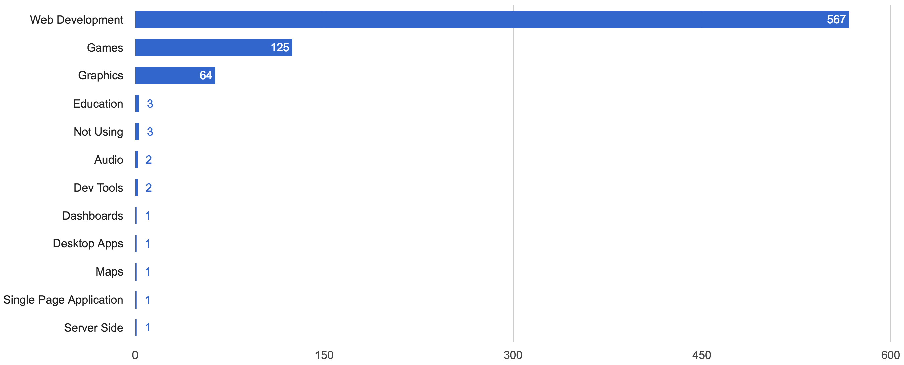
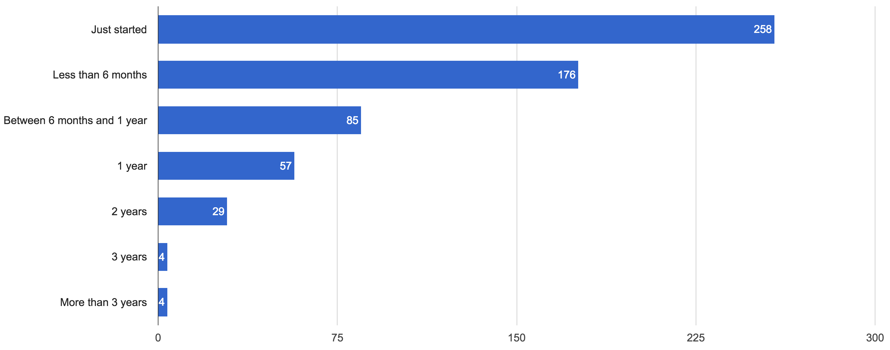
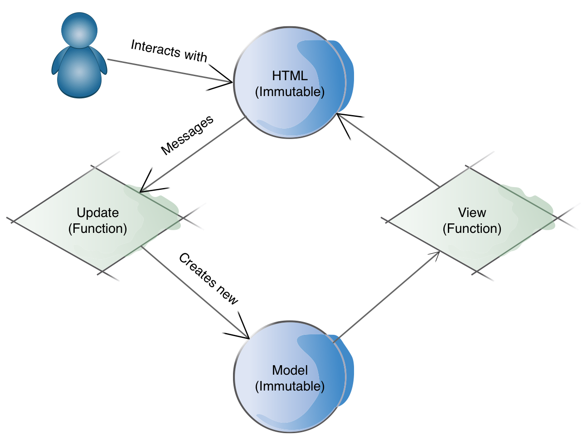
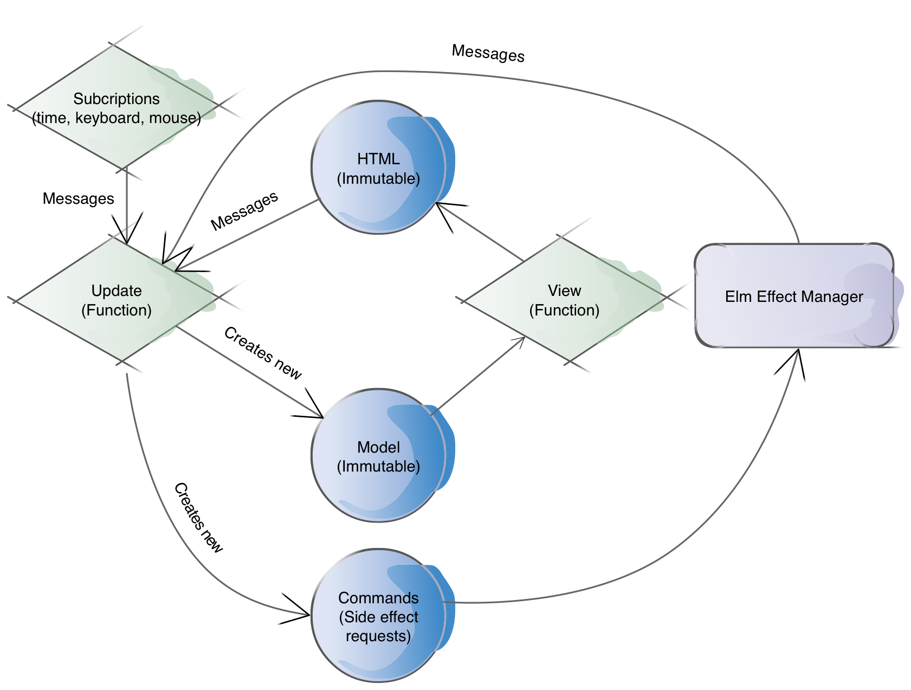

footer: Introduction to Elm / @gbelrose / Lambda Luminaries Meetup 10-04-2017
slidenumbers: true

# Elm

## **Fun**ctional JavaScript for front-end Web Applications

---

# Before we start....

## Lambda Luminaries update

---
# A word from our sponsors

- Invesco Jempstep: facilities, food, drinks
- JetBrains: 1 license per meetup (worth $$$) [^1]
- Manning Publications:
 - 2 eBooks per meetup (worth $$)
 - Use **ug367** for a 36% discount on your purchase

[^1]: Pending further erratic decisions from the President

---

# What is next?

- Control your droid with Cylon.js (Gergana Young)
- Functional JavaScript with F# and Fable (Quintus Marais)
- [ insert your talk here ]

---

# We need your help

- Volunteer to give a talk (short | long )
- Or let us know what you would like us to discuss
- You **could** win something :-)
- If we keep going, **more** JetBrains freebies

---

# Ok, let's start

---

# Elm

## **Fun**ctional JavaScript for front-end Web Applications

### Guillaume (G) Belrose / @gbelrose

---

# About me

- Software engineering for 18 years
- Freelance @ SAM (video content production)
- Web Services (Scala), DevOps (Ansible)
- A bit of JavaScript (WebGL, Web Audio API)

---

# How I got to Elm?

- I worked on a large (40 KLOC) JavaScript
- 1st hand experience with JS fatigue
- In search of a better model

---

# What is Elm?

- By Evan Czaplicki
- Compiles to JavaScript
- FP language, static typing
- Purpose-built for web UIs
- Virtual DOM
- **Opinionated** model for web UIs

---

# Use cases



---

# A young language



---

# FP in Elm

- Stateless (**pure**) functions
- **Immutable** values
- Modules
- No classes / objects / inheritance / prototypes!!
- Not much category theory

---

# Getting started

- `npm install elm`
- Cross platform tool chain (written in Haskell)
- elm-make, elm-reactor, elm-repl, elm-package
- Community tools:
 - Plugins for Atom, VSCode, etc..
 - elm-format, elmjutsu

---
# Syntax overview

- Usual types (Int, Bool, String, ....)
- Immutable (persistent) data structures (list, sets, etc...)
- Union types
- Records (i.e. typed JSON)
- `if .. then` / `let .. in` expressions
- Pattern matching (case expressions)


---
# Functions
- `fn: TypeA -> TypeB -> .. -> ReturnType`
- `fn: ReturnType`
- `fn: a -> Int -> String`
- `hof: (a -> b) -> a -> b`
- `hof: a -> b -> (a -> b)`

---
# Hello, Elm!

```json
{
    "version": "1.0.0",
    "summary": "Simple Elm examples for the Lambda Luminaries Meetup",
    "repository": "https://github.com/user/project.git",
    "license": "BSD3",
    "source-directories": [
        "."
    ],
    "exposed-modules": [],
    "dependencies": {
        "elm-lang/core": "5.1.1 <= v < 6.0.0",
        "elm-lang/html": "2.0.0 <= v < 3.0.0",
        "elm-lang/http": "1.0.0 <= v < 2.0.0",
        "elm-lang/keyboard": "1.0.1 <= v < 2.0.0"
    },
    "elm-version": "0.18.0 <= v < 0.19.0"
}
```

---
# Hello, Elm!

```elm
module HelloElm exposing (..)

import Html exposing (..)


main =
    text "Hello, Elm!"
```

---
# Workflow

```bash
elm-make HelloElm.elm
```

```bash
elm-make HelloElm.elm --output HelloElm.js
```

```bash
-rw-r--r--   1 guillaume  staff        90 27 Mar 18:50 HelloElm.elm
-rw-r--r--   1 guillaume  staff    178639  5 Apr 17:12 HelloElm.js
-rw-r--r--   1 guillaume  staff    178928  5 Apr 17:11 index.html
```

---

# It's just HTML / JS / CSS

```html
<div id="main"></div>
<script src="main.js"></script>
<script>
    var node = document.getElementById('main');
    var app = Elm.Main.embed(node);
    // Note: if your Elm module is named "MyThing.Root" you
    // would call "Elm.MyThing.Root.embed(node)" instead.
</script>
```

---

# Functions and the Virtual DOM

## Live coding attempt #1

---

> Sometimes, the elegant implementation is just a function.  Not a method.  Not a class.  Not a framework.  Just a function.
-- John Carmack

---

# The Elm architecture



---

# Angular Elm

## Live coding attempt #2

---

# The Elm architecture (part II)



---

# Side effects as **Data**

- Describe the event stream(s) you subscribe to
- Or the side effect(s) you want to execute
 - Random generation
 - HTTP requests
- The Elm runtime takes over and does it for you

---

# HTTP requests 

- Describe the URL to GET | POST | etc...
- Describe what to do with the HTTP response
 - How to decode it?
 - What to do with errors | decoded output?
- Submit recipe above to the Elm effect manager

---

# What is the weather?

## Live coding attempt #3

---

# JavaScript interop with ports

- Port: bridge between Elm and JavaScript
- Define an Elm _interface_ for the outgoing / incoming side effects
- Write some JS code for the side effects
- _JavaScript as a Service_


---
# Port from Elm

```elm
port play : () -> Cmd msg
```

---

# Port from JavaScript

```html
<div id="elm"></div>
<script src="trailer.js"></script>
<script>
    var node = document.getElementById('elm');
    var app = Elm.Trailer.embed(node);
    app.ports.play.subscribe(function(){
        var video = document.getElementById('video-player');
        video.play();
    });
```

---

# A video video-player

## Live coding attempt #4

---
# Elm cons

- Might not be your type
- It is not x ( x = Haskell, x = etc..)
- Only at version 0.18 
- Pure FP / managed side effects might seem alien
- “Proper” ways to scale the Elm architecture
- Not backed by Google | Facebook | Microsoft

---

# What about 

- Monads? 
- Functors?
- Typeclasses?
- Applicative?

---

# Elm pros 

- Beginner friendly language
- Great language for learning FP
- Compiler is fast | extremely user friendly
- Refactoring, trade runtime errors for compile errors
- Inclusive community

---

# Prize draw

## Live coding attempt #5

